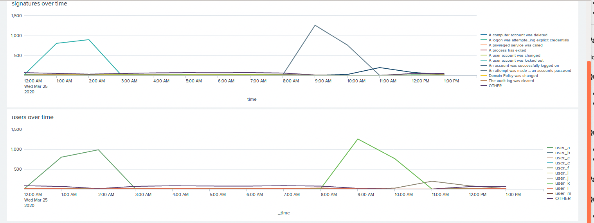

## Unit 19 Homework: Protecting VSI from Future Attacks

### Scenario

In the previous class,  you set up your SOC and monitored attacks from JobeCorp. Now, you will need to design mitigation strategies to protect VSI from future attacks. 

You are tasked with using your findings from the Master of SOC activity to answer questions about mitigation strategies.

### System Requirements 

You will be using the Splunk app located in the Ubuntu VM.

### Logs

Use the same log files you used during the Master of SOC activity:

- [Windows Logs](resources/windows_server_logs.csv)
- [Windows Attack Logs](resources/windows_server_attack_logs.csv)
- [Apache Webserver Logs](resources/apache_logs.txt	)
- [Apache Webserver Attack Logs](resources/apache_attack_logs.txt	)

---

### Part 1: Windows Server Attack

Note: This is a public-facing windows server that VSI employees access.
 
#### Question 1
- Several users were impacted during the attack on March 25th.
- Based on the attack signatures, what mitigations would you recommend to protect each user account? Provide global mitigations that the whole company can use and individual mitigations that are specific to each user.
  > answer:
  > Global Mitigation: Adding two-factor authentication, to make accounts more secure making more difficult for anyone to access account.
  > user_a: User account was locked out, based on the logs attacker tried to brute force its way into the account. Possible ways to mitigate problem would be to change password. Set an alert, to be triggered after multiple login attempts. 
  > user_k: Attempt to reset account password, logs shows many attempts were made to change this users password. Way to mitigate is set an alarm that trigger after more than 1 reset attempt.
  > user_j: account was successfully logged in. Password must be changed immediately.
  

  
#### Question 2
- VSI has insider information that JobeCorp attempted to target users by sending "Bad Logins" to lock out every user.
- What sort of mitigation could you use to protect against this?
  > answer: Create policy that unlock users that get locked out after a set amount of time. Allow login from whitelisted IP addresses
  

### Part 2: Apache Webserver Attack:

#### Question 1
- Based on the geographic map, recommend a firewall rule that the networking team should implement.
- Provide a "plain english" description of the rule.
  - For example: "Block all incoming HTTP traffic where the source IP comes from the city of Los Angeles."
- Provide a screen shot of the geographic map that justifies why you created this rule.
  > Answer: Majority of attacks are coming from Ukraine, a firewall should be setup to block HTTP traffic coming from Ukraine. 
  - Description: "Block all incoming HTTP traffic where the source IP comes from the country of Ukraine" 
  

#### Question 2

- VSI has insider information that JobeCorp will launch the same webserver attack but use a different IP each time in order to avoid being stopped by the rule you just created.

- What other rules can you create to protect VSI from attacks against your webserver?
  - Conceive of two more rules in "plain english". 
  - Hint: Look for other fields that indicate the attacker.
  
  > Answer: I would recommend using "useragent" and "uri_path" to create rules in order to protect VSI
    - rule: "Block all incoming HTTP traffic with useragent "Mozilla/4.0 (compatible; MSIE 6.0; Windows NT 5.2; SV1; .NET CLR 2.0.50727987787; InfoPath.1)"
    - rule: "Block all incoming HTTP traffic with uri_path "/VSI_Account_Logon.php" 

### Guidelines for your Submission:
  
In a word document, provide the following:
- Answers for all questions.
- Screenshots where indicated

Submit your findings in BootCampSpot!

---

© 2020 Trilogy Education Services, a 2U, Inc. brand. All Rights Reserved.
